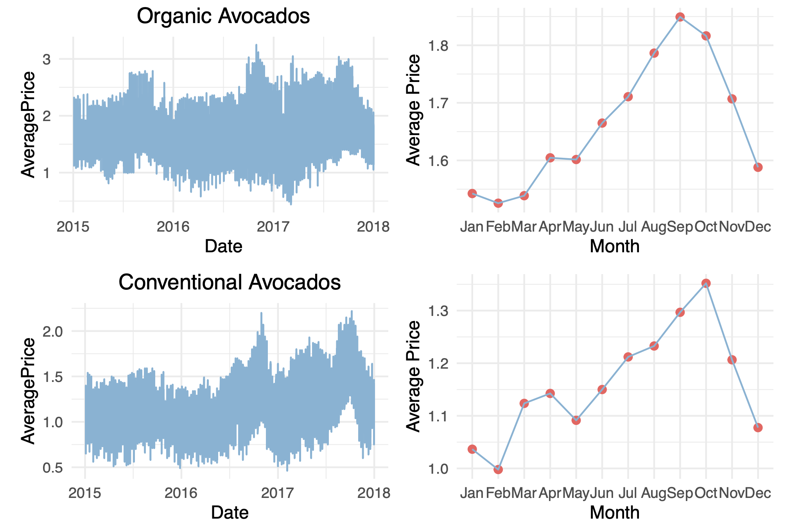
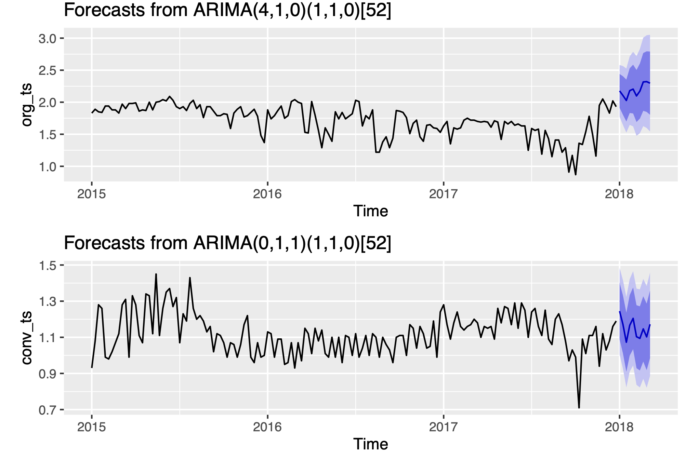
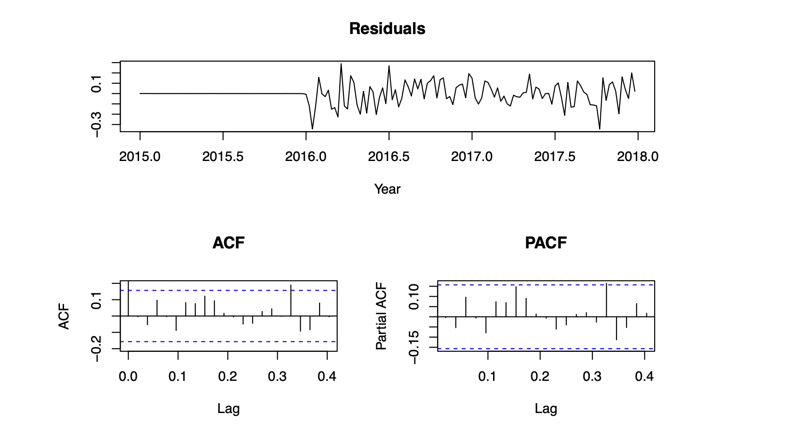

# time-series-analysis-for-avocado

## Abstract

This report presents a comprehensive time series analysis of avocado prices using a dataset spanning from 2015 to 2017. The dataset is first split into training and test datasets to facilitate model development and validation. The training dataset, comprising 16,953 observations, is meticulously explored to understand the distribution of average prices, total volume, and other relevant variables. Initial exploratory data analysis reveals intriguing insights into the distribution of avocado types, regions, and their relationship with average prices.

Outlier detection techniques are employed to identify and remove anomalies that might distort the modeling process. The distinction between organic and conventional avocados is highlighted, shedding light on their respective average prices and regional preferences.

ARIMA is chosen due to its ability to capture both trend and seasonality in time series data. By fitting the training dataset into the ARIMA model, we leverage historical price data to forecast avocado prices for the initial weeks of 2018. Assumptions are made regarding potential underlying insights driving the dynamics of avocado prices, such as consumer preferences, production cycles, and external factors like climate and trade policies.

## Exploratory Data Analysis

Before we start with the Exploratory Data Analysis, we split the given dataset into two parts - training dataset and testing dataset. The splitting of the two dataset has been done in terms of the report object i.e training dataset contains data up until 31st of December 2017 which is 16,953 observations and the testing dataset contains data of the first 10 weeks of the year 2018 which is 1,080 observations, respectively.

Initially, we take a statistical summary of the dataset which enabled us to identify that the AveragePrice attribute contains NULL values so we cleaned the dataset removing the NULL values to produce more accurate results. Since the dataset enables us to explore multiple aspects such as type, region, different PLUs in the dataset, we will explore the Conventional and Organic type of Avocados in the dataset in search of possible trends and patterns.

In the above figure, we explored the dataset of each type of avocados by filtering the data, uncovering distinctive price volatility over time and discerning a clear seasonal pattern in their prices. In time series graph, the prices are quite volatile, with noticeable peaks and troughs, there is no clear trend of increase or decrease in price over this period; instead, it oscillates frequently due to various other factors.  The time series graphs highlight the volatility and the absence of a clear long-term trend, the monthly average graphs reveal a strong seasonal pattern. The monthly average prices shows seasonality by peaking during September - October before declining. 

## Statistical Modelling

### Model Selection and Training
In this analysis, we utilized the ARIMA (AutoRegressive Integrated Moving Average) model to forecast the average price of avocados for both conventional and organic types. After transforming the data into time series objects (`ts`), we visualized the historical price trends using `autoplot`
We have used `auto.arima` function which automatically selects the best ARIMA model for each time series. The `auto.arima` included specifying the degree of differencing (`d` and `D`) while also disabling stepwise selection and opting for the exact fit without going through the approximation process.

These graphs forecasts the first ten-weeks of the year 2018. In both graphs, it seems like the `AveragePrice` is showing a slight upward trend, indicating that the forecasted values are expected to increase over time in 2018. Whereas Organic Avocados seems more promising than Conventional Avocados as it is fluctuating.

### Residual Analysis

From the Residual Analysis of Conventional Avocados, the residuals are randomly distributed around zero, which is a good sign that suggests that the model has captured most of the data. In AutoCorrelation Function several bars exceed the blue dashed lines which indicates significant autocorrelation at those lags, which suggests that past values have an effect on the current value of the time series. In Partial AutoCorrelation Function, there are few bars exceeding the blue dashed line, indicating that there is significant partial autocorrelation at those lags which suggests that there is information in the past values at those lags which is not captured by the data values in between.

## Evaluating the Model
For Evaluating our ARIMA Model, we are using Mean Squared Error (MSE) which is used to evaluate the performance of a predictive model. 

| Type         | MSE |
|:------------:|:-----:|
| Conventional |  0.0869500|
| Organic |  0.8355998 |

The MSE for the “Conventional” type is 0.0869500. This means that, on average, the squared difference between the predicted and actual values for the “Conventional” type is 0.0869500. The smaller this value, the better the model’s predictions which means the model is very accurate.

The MSE for the “Organic” type is 0.8355998. This is significantly higher than the MSE for the “Conventional” type, indicating that the model’s predictions for the “Organic” type are less accurate when comparing to the Conventional type.

By filtering out the test data according to each type (i.e., separating the “Conventional” and “Organic” data), we can create more specific models for each type. This could potentially decrease the error margin rate, as the model can better capture the unique characteristics of each type.